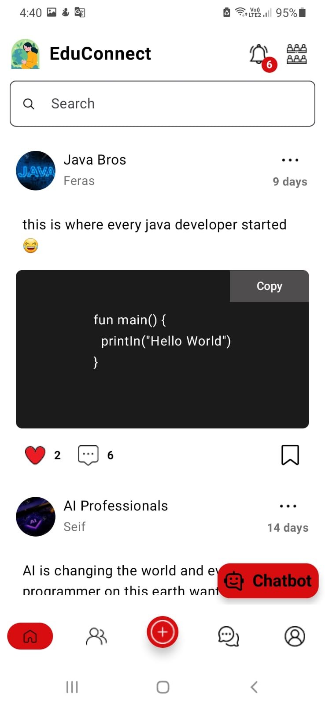
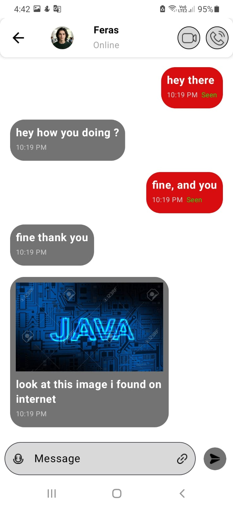
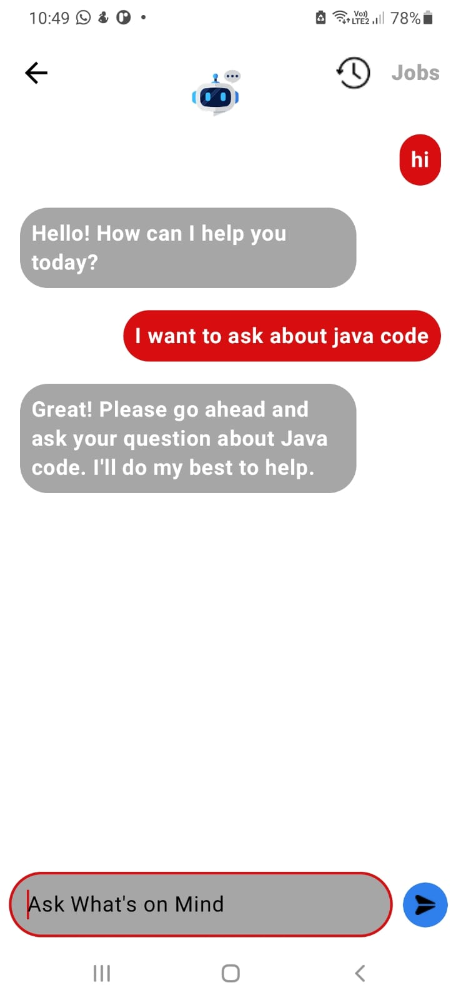
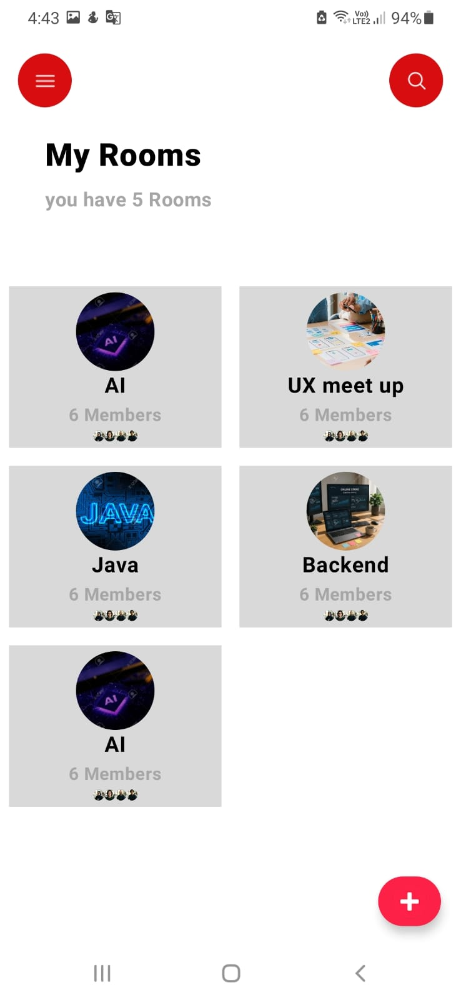
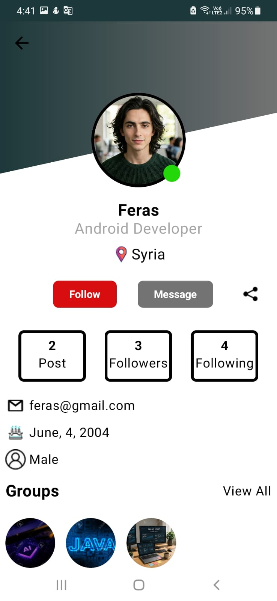
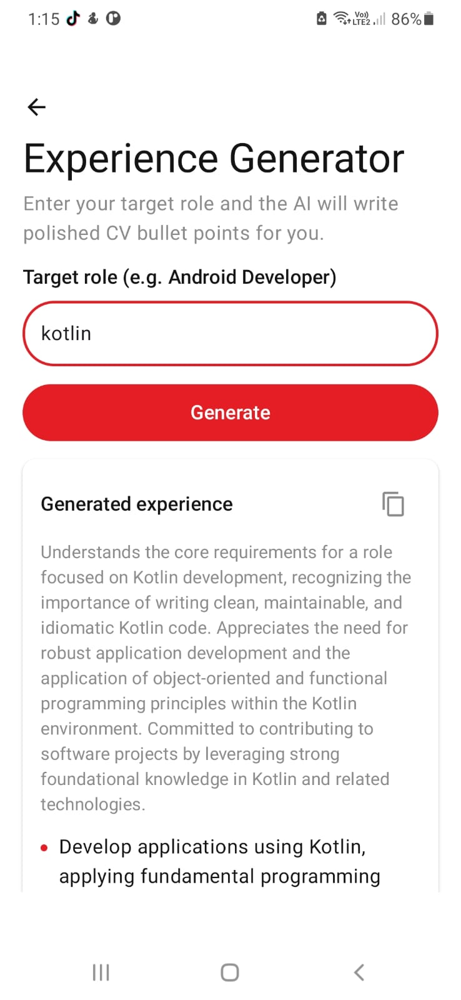

  

<h1 align="center">Programmers Social Platform</h1>

A modern social platform built for developers using Kotlin & Jetpack Compose.

## Demo

| Home | Chat | AI |
|------|------|----|
|  |  |  |

| Communities | Profile | Experience Generator |
|-------------|---------|-------------|
|  |  |  |

## Architecture

Jetpack Compose UI
        │
        ▼
    ViewModel
        │
        ▼
    Repository
        │
        ▼
    Retrofit
        │
        ▼
 ASP.NET Core API
        │
        ▼
      Database

## Features

✅ Authentication

✅ User Profiles

✅ Communities

✅ Posts

✅ Comments

✅ Likes

✅ Real-time Messaging

✅ Notifications

✅ AI Chatbot

✅ AI Code Reviewer

✅ AI Post Analysis

✅ Job Recommendation

Android
├── Kotlin
├── Jetpack Compose
├── MVVM
├── Coroutines
├── StateFlow
├── Retrofit
├── Coil

Backend
├── REST API
├── JWT Authentication

AI
├── Chatbot
├── Code Review
├── Post Analysis

## Author

**Feras Saffour**

Android Developer

LinkedIn : https://www.linkedin.com/in/feras-saffour-317896282/

GitHub : https://github.com/firassaffour

Email : feras.saffour.dev@gmail.com
